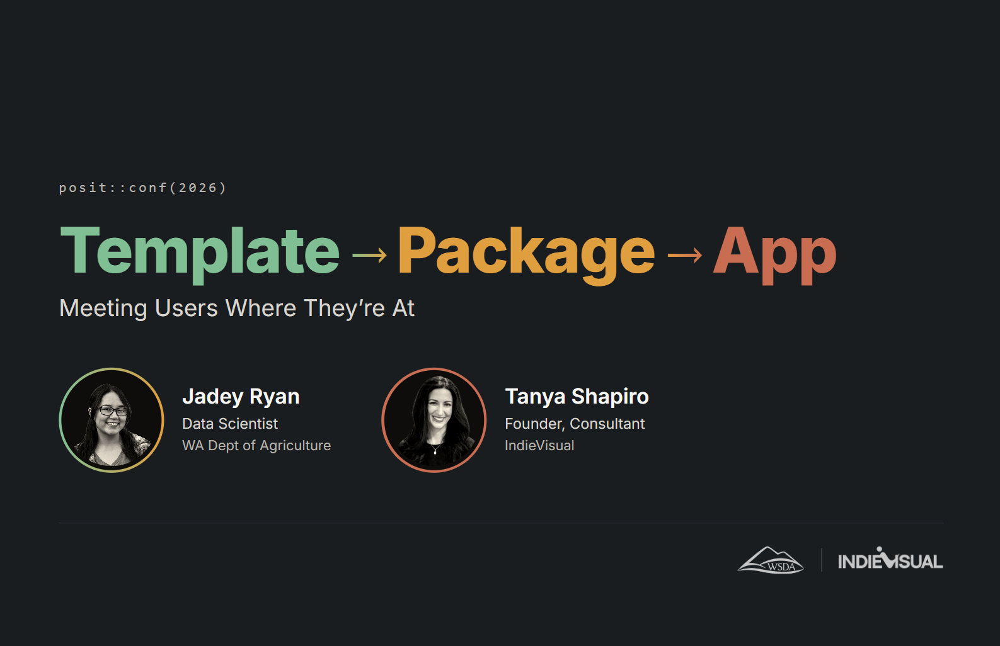

## Template → Package → App: Meeting Users Where They're At

📺 [**Slide Deck**](https://jadeynryan.github.io/posit-conf-2026/#/title)

📦 [**{soils}: R Package**](https://wa-department-of-agriculture.github.io/soils/)

🖥️ [**Dirt Data Reports: Shiny App**](https://wsda.shinyapps.io/dirt-data-reports/)

🌿 [**Jadey's posit::conf(2023) talk on parameterized Quarto templates**](https://jadeyryan.com/talks/2023-09-25_posit_parameterized-quarto/)

Tue, September 15, 2026 | Houston, TX

[posit::conf(2026)](https://conf.posit.co/2026/sessions/)

**Jadey Ryan**: Data Scientist, Washington State Dept of Agriculture

**Tanya Shapiro**: Founder & Consultant, IndieVisual

## Abstract

We built a reporting workflow to help farmers turn complex soil health
data into useful management decisions. What started as a Quarto template
for one specific project became the {soils} R package for other coders,
and eventually Dirt Data Reports, a Shiny app for people who don't code.
This talk is about what we learned while lowering barriers at each step.
Building for the user means choosing the right level of flexibility,
abstraction, and complexity for the people you're trying to reach. The
goal isn't to create one perfect tool; it's to meet users where they're
at.
